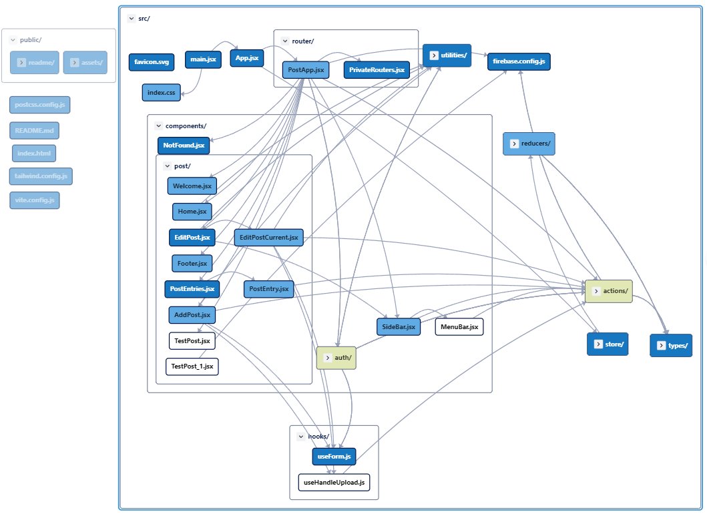

# PROJECT'S NAME: freeFORever

## Demo live 👇
[🤪 Free For Ever](https://freeforever2022.netlify.app)

## Getting the project started

- Fork the project.
  1. Clone the repo

   ```shell
    git clone https://github.com/JordiNodeJS/freeforever
   ```

  2. Change directory to the project directory

   ```shell
   cd freeforever
   ```

- `npm install` 😎 it'll install all dependencies to run the project
- `npm run dev` 👉 to start development server or
- `npm run build` 👉 to compile the project and `npm run preview` 👉 to see the production server working
- Trouble issues: error with AnimXYZ -> install it with the flag --legacy-peer-deps
  - `npm i --legacy-peer-deps @animxyz/core `
  - `npm i --legacy-peer-deps @animxyz/react`

- Running the localhost project 
  - Create firebase account and copy the firebase config to file .env which you should've created at project's root.

- Project will be running in the browser.
   Open [http://localhost:3000](http://localhost:3000) to view it in your browser.
  
 ```javascript
VITE_API_KEY=****
VITE_AUTH_DOMAIN=****
VITE_PROJECT_ID=****
VITE_STORAGE_BUCKET=****
VITE_MESSAGING_SENDER_ID=****
VITE_APP_ID=****
```
  - For loading images you should have a Cloudinary account and create environment variable as:
  ```javascript
  VITE_API_CLOUDINARY_URL_UPLOAD=***
  VITE_API_CLOUDINARY_CLOUDNAME=***  
  ```
  - Then, you should config some set in your Cloudinary account:
    - Go to settings and in the tab Upload scroll at Upload presets Option and set it as **Unsigned** mode in the cloud name.

## Tecnological stack

- [Vite](https://vitejs.dev/) ⚡ (French word for ⚡"quick", pronounced /vit/, like "veet") is a build tool that aims to provide a ⚡faster and leaner development experience for modern web projects. ⛔ creat-react-app, why? 👉 It's slow, just bloody sluggish. Vite, under the hood, runs esbuild to compile the code. 💪 Written in Golang, a compileted language, result: blazing [fast](https://ageek.dev/esbuild) builds 👇 
  - Welcome 🎉💗💓 [Tailwind CSS](https://tailwindcss.com/) works by scanning all of your HTML files, JavaScript components, and any other templates for class names, generating the corresponding styles and then writing them to a static CSS file. It's⚡fast, flexible, and reliable — with zero-runtime. Goodby ⛔Bootstrap yet the bundle size is still too big.
  - [daisyUI](https://daisyui.com/) is a library that provides a set of components that can be used to build a responsive, mobile-first, and accessible UI.
  - [Postcss](https://postcss.org/) 🏎⚡ is used to elimanate the need for a CSS preprocessor and to make it easier to add features like autoprefixing and custom properties. Goodby 🚫SASS. Postcss does tree-shaking; it's used to remove unused code from the bundle.
  - [cssnano](https://cssnano.co/) is used to minify the css.
- [React](https://reactjs.org/)

  - [React Hooks](https://reactjs.org/docs/hooks-intro.html)
  - [React Router v6](https://reactrouter.com/docs/en/v6/getting-started/overview)
    - `npm install react-router-dom@6`
  - [Redux-ES](https://es.redux.js.org/)
  - [React-Redux](https://react-redux.js.org/)
    - `npm install react-redux redux`
    - `npm install --save-dev @redux-devtools/core`
  - [Async Logic and Data Fetching](https://redux.js.org/docs/advanced/AsyncActions.html)
    - [Redux Thunk](https://www.npmjs.com/package/redux-thunk)
    - [Writing Logic with Thunks](https://redux.js.org/usage/writing-logic-thunks)

- validator.js is a JavaScript library that validates the structure of JavaScript objects.

- [react-toastify](https://www.npmjs.com/package/react-toastify) is a React component library that provides a simple way to display toast messages.`npm install --save --force react-toastify`

- [React icons](https://react-icons.github.io/react-icons)


- Backend with [Firebase](https://console.firebase.google.com/)


# App Map
### To see whole interactive map click the link (easy peasy)
[App Map Codesee](https://app.codesee.io/maps/public/2c11a4a0-061f-11ed-8830-5f479ea9b463)



## Features' App

### Goals achived

- Register:
  - With your own email.
  - By Gmail account.

- Login
- Private Routes
  - You can access them by login.


- Post's Edition with Firebase.
  - CRUD operations: Create, Read, Update and Delete your posts recorded in a database as Firebase.

## Issues

You've found a bug in the source code, a mistake in the documentation or maybe you'd like a new feature? You can help us by 👇

<details>
    <summary><strong>Submitting an issue on GitHub</strong></summary>
    <h4>Creating an issue from a repository</h4>
    <ol>
      <li>On GitHub.com, navigate to the main page of the repository.</li>
      <li>Under your repository name, click Issues.</li>
      <li>Click New issue.</li>
      <li>Type a title and description for your issue.</li>
    </ol>
</details>


Before you create an issue, make sure to search the issue archive -- your issue may have already been addressed!

Please try to create bug reports that are:

- _Reproducible._ Include steps to reproduce the problem.
- _Specific._ Include as much detail as possible: which version, what environment, etc.
- _Unique._ Do not duplicate existing opened issues.
- _Scoped to a Single Bug._ One bug per report.

## Pull Request

There are 2 main work flows when dealing with pull requests:

- Pull Request from a [forked repository](https://help.github.com/articles/fork-a-repo)
- Pull Request from a branch within a repository

Here we are going to focus on 2. Creating a Topical Branch:

1. First, we will need to create a branch from the latest commit on master. Make sure your repository is up to date first using

   ```bash
    git pull origin main
   ```

   _Note:_ `git pull` does a `git fetch` followed by a `git merge` to update the local repo with the remote repo. For a more detailed explanation, see [this stackoverflow post](http://stackoverflow.com/questions/292357/whats-the-difference-between-git-pull-and-git-fetch).

2. To create a branch, use `git checkout -b <new-branch-name> [<base-branch-name>]`, where `base-branch-name` is optional and defaults to `main`.

   Use a standard convention for branch names. For example, `<your-name>-dev`. It will be easier to track your pull requests if you use this convention.

   I'm going to create a new branch called `jsm-dev` from the `main` branch and push it to github.

   ```bash
    git checkout -b jsm-dev main
    git push origin jsm-dev
   ```

3. To create a pull request, you must have changes committed to your new branch.

4. Go to [Pull Requests](https://github.com/JavaScript-Mastery-PRO/project1_team4_repository/pulls) and click on the `New Pull Request` button.

5. Select the `main` branch as the `base` branch and the `jsm-dev` branch as the `compare` branch.

6. Follow the template and fill in the proper information for the pull request.

7. Click on the `Submit` button.

8. You have successfully created a pull request. Now wait for mentor approval. Once approved, you can merge the pull request.

### MIT License
Copyright 2022 ©

Permission is hereby granted, free of charge, to any person obtaining a copy of this software and associated documentation files (the "Software"), to deal in the Software without restriction, including without limitation the rights to use, copy, modify, merge, publish, distribute, sublicense, and/or sell copies of the Software, and to permit persons to whom the Software is furnished to do so, subject to the following conditions:

The above copyright notice and this permission notice shall be included in all copies or substantial portions of the Software.

THE SOFTWARE IS PROVIDED "AS IS", WITHOUT WARRANTY OF ANY KIND, EXPRESS OR IMPLIED, INCLUDING BUT NOT LIMITED TO THE WARRANTIES OF MERCHANTABILITY, FITNESS FOR A PARTICULAR PURPOSE AND NONINFRINGEMENT. IN NO EVENT SHALL THE AUTHORS OR COPYRIGHT HOLDERS BE LIABLE FOR ANY CLAIM, DAMAGES OR OTHER LIABILITY, WHETHER IN AN ACTION OF CONTRACT, TORT OR OTHERWISE, ARISING FROM, OUT OF OR IN CONNECTION WITH THE SOFTWARE OR THE USE OR OTHER DEALINGS IN THE SOFTWARE.