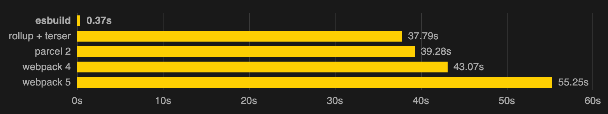

# PROJECT'S NAME: freeFORever

## Getting the project started

- Fork the project.
- `npm install` 😎 it'll install all dependencies to run the project
- `npm run dev` 👉 to start development server or
- `npm run build` 👉 to compile the project and `npm run preview` 👉 to see the production server working
- Trouble issues: error with AnimXYZ -> install it with the flag --legacy-peer-deps
  - `npm i --legacy-peer-deps @animxyz/core `
  - `npm i --legacy-peer-deps @animxyz/react`

- Running the localhost project 
  - Create firebase account and copy the firebase config to file .env which you should've created at project's root.
  
 ```javascript
VITE_API_KEY=****
VITE_AUTH_DOMAIN=****
VITE_PROJECT_ID=****
VITE_STORAGE_BUCKET=****
VITE_MESSAGING_SENDER_ID=****
VITE_APP_ID=****
```
  - For loading images you should have a Cloudinary account and create environment variable as:
  ```javascript
  VITE_API_CLOUDINARY_URL_UPLOAD=***
  VITE_API_CLOUDINARY_CLOUDNAME=***  
  ```
  - Then, you should config some set in your Cloudinary account:
    - Go to settings and in the tab Upload scroll at Upload presets Option and set it as **Unsigned** mode in the cloud name.

## Tecnological stack

- [Vite](https://vitejs.dev/) ⚡ (French word for ⚡"quick", pronounced /vit/, like "veet") is a build tool that aims to provide a ⚡faster and leaner development experience for modern web projects. ⛔ creat-react-app, why? 👉 It's slow, just bloody sluggish. Vite, under the hood, runs esbuild to compile the code. 💪 Written in Golang, a compileted language, result: blazing [fast](https://ageek.dev/esbuild) builds 👇 
  - Welcome 🎉💗💓 [Tailwind CSS](https://tailwindcss.com/) works by scanning all of your HTML files, JavaScript components, and any other templates for class names, generating the corresponding styles and then writing them to a static CSS file. It's⚡fast, flexible, and reliable — with zero-runtime. Goodby ⛔Bootstrap yet the bundle size is still too big.
  - [daisyUI](https://daisyui.com/) is a library that provides a set of components that can be used to build a responsive, mobile-first, and accessible UI.
  - [Postcss](https://postcss.org/) 🏎⚡ is used to elimanate the need for a CSS preprocessor and to make it easier to add features like autoprefixing and custom properties. Goodby 🚫SASS. Postcss does tree-shaking; it's used to remove unused code from the bundle.
  - [cssnano](https://cssnano.co/) is used to minify the css.
- [React](https://reactjs.org/)

  - [React Hooks](https://reactjs.org/docs/hooks-intro.html)
  - [React Router v6](https://reactrouter.com/docs/en/v6/getting-started/overview)
    - `npm install react-router-dom@6`
  - [Redux-ES](https://es.redux.js.org/)
  - [React-Redux](https://react-redux.js.org/)
    - `npm install react-redux redux`
    - `npm install --save-dev @redux-devtools/core`
  - [Async Logic and Data Fetching](https://redux.js.org/docs/advanced/AsyncActions.html)
    - [Redux Thunk](https://www.npmjs.com/package/redux-thunk)
    - [Writing Logic with Thunks](https://redux.js.org/usage/writing-logic-thunks)

- validator.js is a JavaScript library that validates the structure of JavaScript objects.

- [Animxyz](https://animxyz.com/) AnimXYZ is an animation library that simplifies adding CSS animations to a website or web application. AnimXYZ animations all compile to regular CSS behind the scenes, meaning they generally behave the same way CSS animations do. Once the page loads, the elements trigger automatically, run for the specified number of iterations, and then return to their original state.
  - [Article blog](https://blog.logrocket.com/animate-react-app-animxyz/)
  - `npm install @animxyz/core`
- [react-toastify](https://www.npmjs.com/package/react-toastify) is a React component library that provides a simple way to display toast messages.`npm install --save --force react-toastify`

- [React icons](https://react-icons.github.io/react-icons)


- Backend with [Firebase](https://console.firebase.google.com/)

### Helpers 
Alias Command shell edition for git:

```  nano ~/.profile ```
```bash
/c/Users/neo/.profile

alias gco="git checkout"
alias gcb="git checkout -b"
alias gb="git branch"
alias gba="git branch -a"
alias gbvva="git branch -vva"
alias gm="git merge"
alias gbd="git branch -d"
alias gbD="git branch -D"
alias gs="git status"
alias ga="git add ."
alias gcm="git commit -m"
alias gpush="git push"
alias gpull="git pull"
alias gpusho="git push origin"
alias gl="git log --oneline --graph"
alias glog="git log --graph --pretty=format:'%Cred%h%Creset -%C(yellow)%d%Crese>
alias dev="npm run dev"


```
